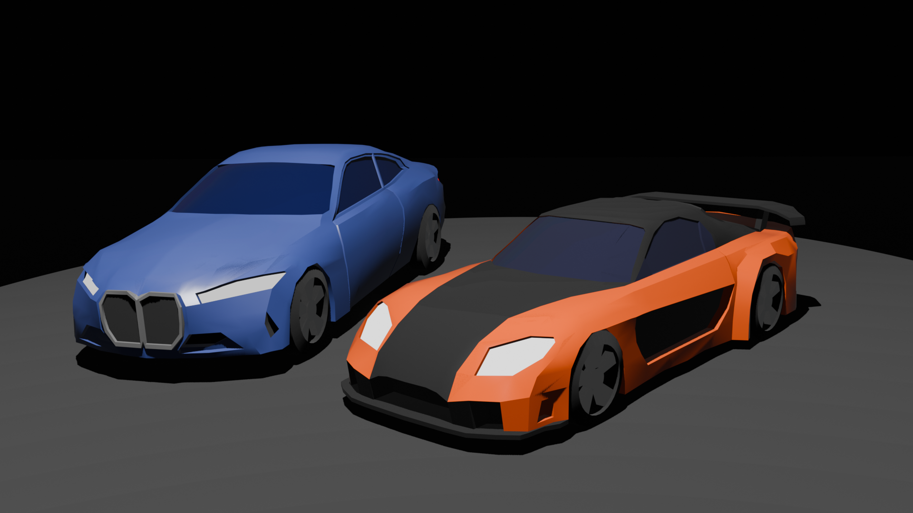

# Infinite Drive v0.5.0

## Project Description

This project is a 3D web-based driving simulator game that allows you to drive on an endless, four-laned highway. As you cruise, the game displays a visually pleasing urban environment with dynamic city lights. The player controls their designated car with the ability to turn, accelerate, and decelerate. The objective is simply to enjoy an infinite driving experience as the road and game environment continue endlessly. The majority of this project was created in the span of 29 days.

## Libraries

- Three.js
- OrbitControls.js
- GLTFLoader.js
- CANNON

## Current Implementations

- 3D Model of Player’s Car 
- Player headlights and taillights
- Player tires rotate based on player’s speed
- Player Shift Left-to-Right Controls
- Player Acceleration and Deceleration Controls
- Player HUD - Displays MPH and total score (based on total distance)
- Created continuously generated road
- Created continuously generated buildings with glow material (random color) for windows
- Created continuously generated road barrier with collision
- Implemented gravity and ground collision detection
- Created NPC 3D car model with tire rotation animation
- Simple NPC car spawn set-up
- Randomized colors of NPC cars
- Implemented efficient NPC spawn system (spawned on each road segment)
- Implemented an end-game UI (with final score) that allows player to restart after colliding
- Implemented street lights using an alternate version of the base road barrier model

## Planned Implementations for v1.0.0

- ~~Smooth shade both NPC car and PLAYER car~~
- ~~Allow player to input desired Car color and leaderboard name~~
- Create visually pleasing Start game screen
- Prevent player from driving opposite direction of road
- Spawn NPC car spawns behind slow Player
- Create more 3D skyscraper models
- Allow pause menu using ESC key
- Create rechargeable nitrous particle effect + speed boost
- Create visually pleasing HUD
- Create visually pleasing Retry screen
- Create visually pleasing leaderboard
- Connect leaderboard to firebase (name + distance)

