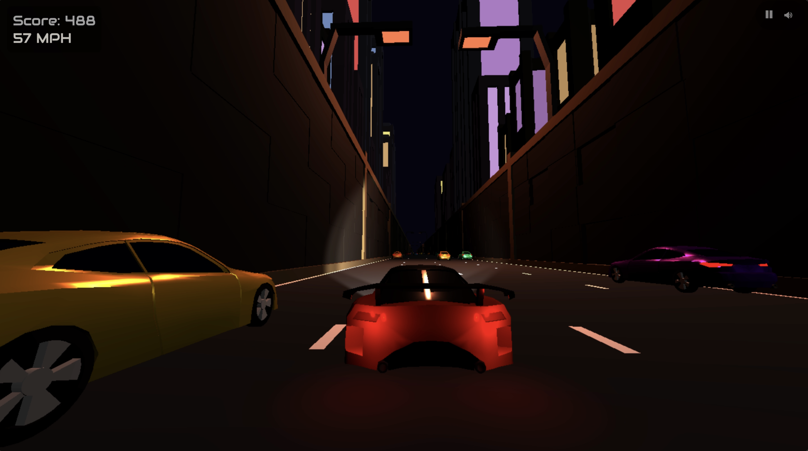
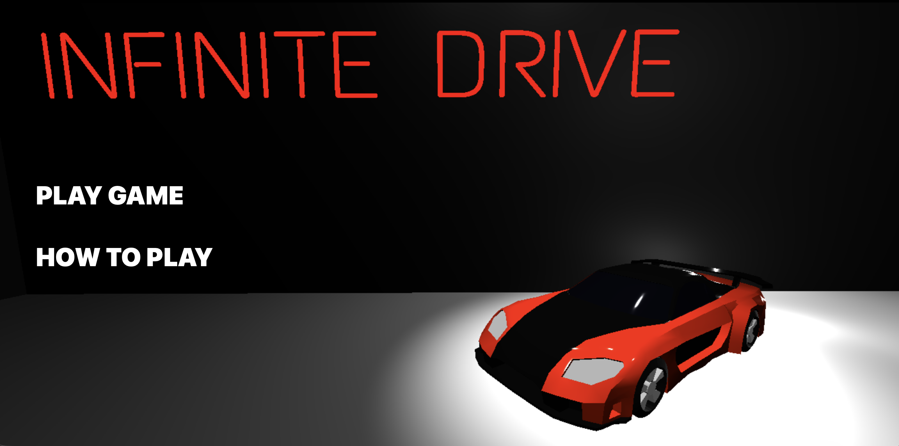

# Infinite Drive v1.1
*3D Driving Game - Take A Nighttime Drive Through An Infinitely Generating World with Traffic!*

## Tech Stack
- Vanilla HTML, CSS, Javascript
- Three.js - 3D Rendering
- Cannon.js - Physics Simulation

## Play Live Demo Now On My Itch.io Page

## Key Features
- Infinitely generating world including a four-laned highway, city skyscrapers, and street lights
- NPC car spawn system to simulate traffic with randomized color system
- Difficulty setting allowing player to choose how populated the traffic is
- Player driving controls and physics-based crash detection system. 
- Player car includes functional taillights, headlights, and rotating tires.
- Settings UI allowing you to mute or pause the game
- Title Screen with 'How to Play' section and Player Car Color Picker
- End Game / Restart UI allowing replayability

## Controls
- W: Accelerate
- A: Shift Left
- S: Brake
- D: Shift Right
- M: Mute/Unmute Game
- P: Pause/Unpause Game

## Challenges
- First time ever using 3D modeling applications and Three.js, required significant time to learn fundamentals.
- Wanted to keep all 3D assets self-made and low-poly, so they were created in Blender and contributed to a lightweight 2.9 MB project file size.
- Ran into performance issues, requiring optimization of the world generation and spotlights within the project.

## Title Screen

## Credits
- "Play" and "Pause" icons by Noah Jacobus (SVGRepo, PD License)
- "Mute" and "Unmute" icons by Financial Times (SVGRepo, MIT License)
- Engine & crash sound effects via Pixabay
